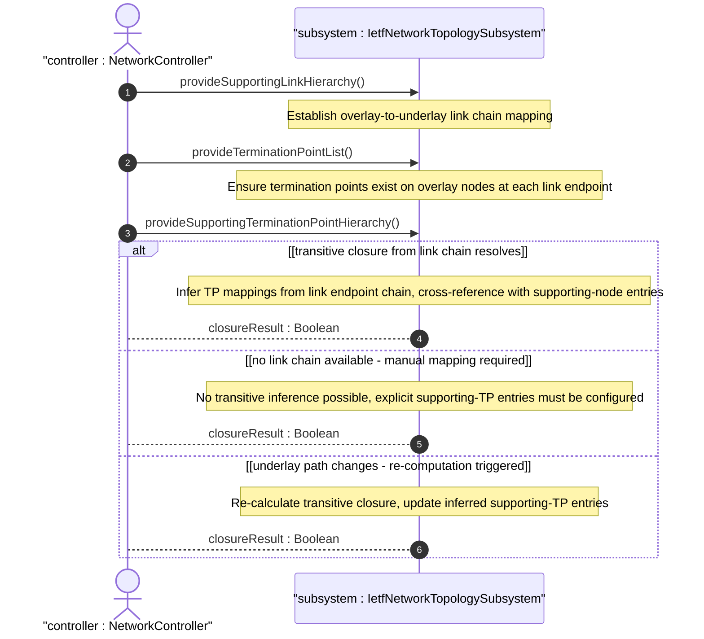

# User Story: Resolve Supporting Termination Point Mappings via Transitive Closure

## Parent Epic
- [ ] #125 - [ietf-network-topology: Base Network Topology Augmentation](https://github.com/gintatkinson/3dgs-033/blob/main/docs/epics/epic-09-ietf-network-topology.md) (supporting-termination-point transitive dependency inference from link-level mappings, clause 4.4.7)

## Domain Object Mapping
- **Primary Domain Objects:** TerminationPoint, SupportingTerminationPoint, SupportingLink, SupportingNode, network-ref, node-ref, tp-ref
- **Actor/Role:** NetworkController — the topology management system that infers or explicitly populates termination-point underlay mappings from link and node-level dependencies

## BDD Scenario (OOA/OOD Realization)

**As a** NetworkController
**I want to** populate the supporting-termination-point list through transitive closure from the supporting-link chain and node-level supporting-node entries
**So that** termination-point underlay mappings do not have to be redundantly configured and remain consistent with the link-level dependency graph

**Given** an overlay link "vpn-tunnel-chi-sfo" mapping onto three underlay links in "l3-underlay" via its supporting-link list
**And** each overlay link endpoint references a termination point on its respective overlay node
**And** each overlay node has supporting-node entries mapping to underlay nodes
**When** the topology management system computes the transitive closure from the supporting-link chain
**Then** for the source termination point of the overlay link, a supporting-termination-point entry is inferred referencing the source termination point of the first underlay link in the chain
**And** for the destination termination point of the overlay link, a supporting-termination-point entry is inferred referencing the destination termination point of the last underlay link in the chain
**And** both inferred mappings are consistent with the link-level supporting-link entries

**Given** termination points with supporting-termination-point entries derived via transitive closure
**When** the underlay link chain changes due to topology reconfiguration
**Then** the inferred supporting-termination-point entries are re-computed to reflect the new underlay path
**And** any previously inferred mappings that are no longer valid are removed

**Given** a termination point that has no supporting-link chain to derive from
**When** the controller explicitly configures supporting-termination-point entries manually
**Then** the explicit mapping overrides any inferred mapping
**And** the termination point is explicitly associated with the specified underlay termination points

## UML Sequence Diagram

## Operational Context

From the IETF Network Topologies YANG Data Model specification, Section 4.4.7 (Mapping Redundancy):

"In a hierarchy of networks, there are nodes mapping to nodes, links mapping to links, and termination points mapping to termination points. Some of this information is redundant. Specifically, if the mapping of a link to one or more other links is known and the termination points of each link are known, the mapping information for the termination points can be derived via transitive closure and does not have to be explicitly configured."

From the ietf-network-topology YANG module, supporting-termination-point description (lines 249-260):

"This list identifies any termination points on which a given termination point depends or onto which it maps. Those termination points will themselves be contained in a supporting node. This dependency information can be inferred from the dependencies between links. Therefore, this item is not separately configurable. Hence, no corresponding constraint needs to be articulated. The corresponding information is simply provided by the implementing system."

## Required Features Matrix
- [ ] #131 - [Define Supporting Node List](https://github.com/gintatkinson/3dgs-033/blob/main/docs/features/feat-43-supporting-node-list.md) (node-level underlay mapping provides the node context for supporting-TP chain resolution)
- [ ] #135 - [Define Supporting Link List](https://github.com/gintatkinson/3dgs-033/blob/main/docs/features/feat-47-supporting-link-list.md) (supporting-link chain is the primary source for transitive TP mapping inference)
- [ ] #136 - [Define Termination Point List](https://github.com/gintatkinson/3dgs-033/blob/main/docs/features/feat-48-termination-point-list.md) (termination points anchor link endpoints, their underlay mappings are the target of transitive closure)
- [ ] #137 - [Define Supporting Termination Point List](https://github.com/gintatkinson/3dgs-033/blob/main/docs/features/feat-49-supporting-termination-point-list.md) (supporting-termination-point list receives the inferred or explicitly configured underlay TP references)

## Source References
Structural Schema: [ietf-network-topology@2018-02-26.yang](https://github.com/YangModels/yang/blob/main/standard/ietf/RFC/ietf-network-topology%402018-02-26.yang) (Clause: 6.2, lines 249-291)
Normative Specification: [the IETF Network Topologies YANG Data Model specification](https://datatracker.ietf.org/doc/rfc8345/) (Clause: 4.4.7)
