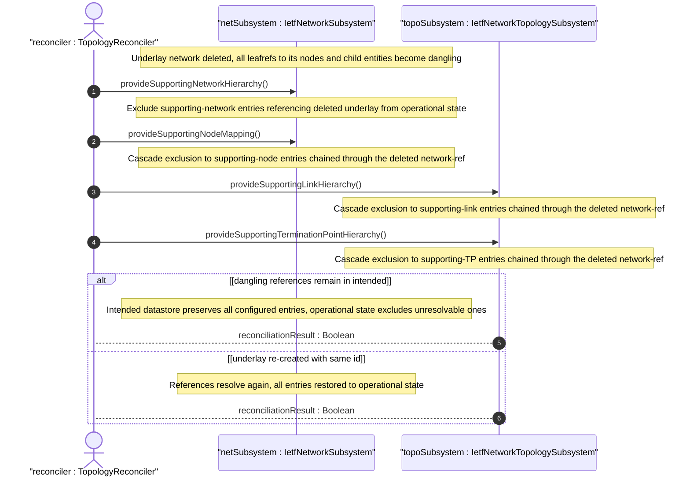

# User Story: Reconcile Overlay Topology When Underlay Network Is Deleted

## Parent Epic
- [ ] #124 - [ietf-network: Base Network Data Model](https://github.com/gintatkinson/3dgs-033/blob/main/docs/epics/epic-08-ietf-network.md) (dangling leafref exclusion from operational state for network-level churn, clause 4.4.3)
- [ ] #125 - [ietf-network-topology: Base Network Topology Augmentation](https://github.com/gintatkinson/3dgs-033/blob/main/docs/epics/epic-09-ietf-network-topology.md) (cascading impact on topology-level supporting-link and supporting-TP entries, clause 4.4.3)

## Domain Object Mapping
- **Primary Domain Objects:** Network, SupportingNetwork, SupportingNode, SupportingLink, SupportingTerminationPoint, network-ref
- **Actor/Role:** TopologyReconciler — the system component that monitors underlay churn and reconciles overlay references by excluding unresolvable entries from operational state

## BDD Scenario (OOA/OOD Realization)

**As a** TopologyReconciler
**I want to** detect deletion of an underlay network and reconcile all dependent overlay references across network, node, link, and termination-point levels
**So that** the operational state datastore reflects only resolved topology information while preserving intended configuration for future reconciliation

**Given** an overlay network "vpn-overlay" with a supporting-network entry referencing underlay "core-l3-igp"
**And** overlay nodes in "vpn-overlay" have supporting-node entries referencing nodes in "core-l3-igp"
**And** overlay links have supporting-link entries referencing links in "core-l3-igp"
**And** overlay termination points have supporting-termination-point entries referencing TPs in "core-l3-igp"
**When** the underlay network "core-l3-igp" is deleted from the network list
**Then** the supporting-network entry in "vpn-overlay" referencing "core-l3-igp" is excluded from the operational state datastore
**And** all supporting-node entries whose network-ref chains through the deleted network are excluded from operational state
**And** all supporting-link entries whose network-ref chains through the deleted network are excluded from operational state
**And** all supporting-termination-point entries whose network-ref chains through the deleted network are excluded from operational state
**And** all excluded entries remain in the intended datastore as dangling references awaiting re-resolution

**Given** the underlay network "core-l3-igp" has been deleted and overlay references are dangling
**When** the underlay network is re-created with the same network-id
**Then** the system detects the reference resolution
**And** all previously dangling supporting-network, supporting-node, supporting-link, and supporting-termination-point entries are restored to the operational state datastore

**Given** an overlay network with dangling supporting-network entries
**When** a client queries the operational state datastore
**Then** only resolved entries are returned
**And** dangling entries are invisible in operational state but remain queryable in intended configuration

## UML Sequence Diagram

## Operational Context

From the IETF Network Topologies YANG Data Model specification, Section 4.4.3 (Dealing with Changes in Underlay Networks):

"It is possible for a network to undergo churn even as other networks are layered on top of it. When a supporting node, link, or termination point is deleted, the supporting leafrefs in the overlay will be left dangling. To allow for this possibility, the data model makes use of the 'require-instance' construct of YANG 1.1."

"A dangling leafref of a configured object leaves the corresponding instance in a state in which it lacks referential integrity, effectively rendering it nonoperational. Any corresponding object instance is therefore removed from the operational state datastore until the situation has been resolved."

## Required Features Matrix
- [ ] #129 - [Define Supporting Network List](https://github.com/gintatkinson/3dgs-033/blob/main/docs/features/feat-41-supporting-network-list.md) (supporting-network entries are the primary targets of reconciliation when underlay networks are deleted)
- [ ] #131 - [Define Supporting Node List](https://github.com/gintatkinson/3dgs-033/blob/main/docs/features/feat-43-supporting-node-list.md) (supporting-node entries cascade into operational exclusion when their network-ref becomes unresolvable)
- [ ] #135 - [Define Supporting Link List](https://github.com/gintatkinson/3dgs-033/blob/main/docs/features/feat-47-supporting-link-list.md) (supporting-link entries are excluded when the underlay network containing the referenced link is deleted)
- [ ] #137 - [Define Supporting Termination Point List](https://github.com/gintatkinson/3dgs-033/blob/main/docs/features/feat-49-supporting-termination-point-list.md) (supporting-TP entries are excluded when the chained underlay network reference becomes unresolvable)

## Source References
Structural Schema: [ietf-network@2018-02-26.yang](https://github.com/YangModels/yang/blob/main/standard/ietf/RFC/ietf-network%402018-02-26.yang) (Clause: 6.1)
Structural Schema: [ietf-network-topology@2018-02-26.yang](https://github.com/YangModels/yang/blob/main/standard/ietf/RFC/ietf-network-topology%402018-02-26.yang) (Clause: 6.2)
Normative Specification: [the IETF Network Topologies YANG Data Model specification](https://datatracker.ietf.org/doc/rfc8345/) (Clause: 4.4.3)
