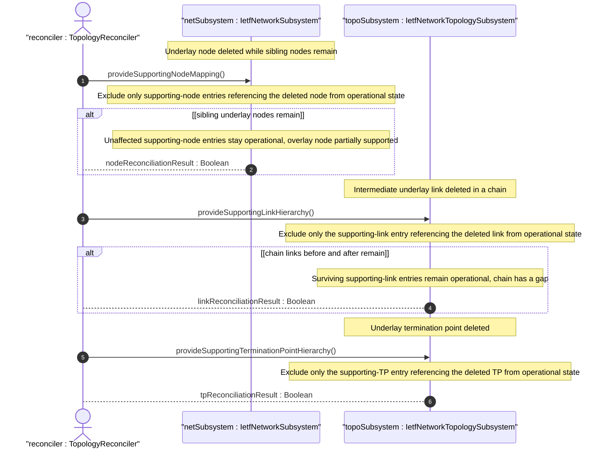

# User Story: Reconcile Overlay Topology When Underlay Nodes or Links Change

## Parent Epic
- [ ] #124 - [ietf-network: Base Network Data Model](https://github.com/gintatkinson/3dgs-033/blob/main/docs/epics/epic-08-ietf-network.md) (node-level supporting-node reconciliation on underlay node deletion, clause 4.4.3)
- [ ] #125 - [ietf-network-topology: Base Network Topology Augmentation](https://github.com/gintatkinson/3dgs-033/blob/main/docs/epics/epic-09-ietf-network-topology.md) (link-level and TP-level reconciliation on underlay entity churn, clause 4.4.3)

## Domain Object Mapping
- **Primary Domain Objects:** Node, Link, SupportingNode, SupportingLink, SupportingTerminationPoint, node-ref, link-ref
- **Actor/Role:** TopologyReconciler — the system component that detects underlay entity churn at the node and link granularity and reconciles dependent overlay references

## BDD Scenario (OOA/OOD Realization)

**As a** TopologyReconciler
**I want to** detect deletion or modification of individual underlay nodes and links and reconcile exactly the affected overlay references without over-excluding unrelated entries
**So that** partial underlay churn results in surgical operational state exclusion rather than wholesale overlay invalidation

**Given** an overlay node "virtual-router-01" with supporting-node entries referencing underlay nodes "baremetal-server-07" and "baremetal-server-12"
**When** underlay node "baremetal-server-07" is deleted but "baremetal-server-12" remains operational
**Then** only the supporting-node entry referencing "baremetal-server-07" is excluded from operational state
**And** the supporting-node entry referencing "baremetal-server-12" remains operational
**And** the overlay node "virtual-router-01" remains partially supported and queryable

**Given** an overlay link "vpn-tunnel-chi-sfo" with supporting-link entries referencing three underlay links L1, L2, L3
**When** underlay link L2 is deleted due to an intermediate router failure
**Then** only the supporting-link entry referencing L2 is excluded from operational state
**And** entries referencing L1 and L3 remain operational
**And** the overlay link is partially supported with a gap in its underlay chain

**Given** an overlay termination point with a supporting-termination-point entry
**When** the referenced underlay termination point is deleted while the underlay node remains
**Then** the supporting-termination-point entry is excluded from operational state
**And** the supporting-node entry at the parent node level is not affected

**Given** a set of dangling entries in the intended datastore
**When** the deleted underlay entities are re-created
**Then** the affected entries are individually restored to operational state
**And** entries that remained operational throughout are not disturbed

## UML Sequence Diagram

## Operational Context

From the IETF Network Topologies YANG Data Model specification, Section 4.4.3 (Dealing with Changes in Underlay Networks):

"It is possible for a network to undergo churn even as other networks are layered on top of it. When a supporting node, link, or termination point is deleted, the supporting leafrefs in the overlay will be left dangling."

"A dangling leafref of a configured object leaves the corresponding instance in a state in which it lacks referential integrity, effectively rendering it nonoperational. Any corresponding object instance is therefore removed from the operational state datastore until the situation has been resolved."

## Required Features Matrix
- [ ] #130 - [Define Node List](https://github.com/gintatkinson/3dgs-033/blob/main/docs/features/feat-42-node-list.md) (node deletion triggers cascading supporting-node exclusion, nodes are the referenced underlay entities)
- [ ] #131 - [Define Supporting Node List](https://github.com/gintatkinson/3dgs-033/blob/main/docs/features/feat-43-supporting-node-list.md) (supporting-node entries are surgically excluded when their referenced underlay node is deleted)
- [ ] #132 - [Define Link List](https://github.com/gintatkinson/3dgs-033/blob/main/docs/features/feat-44-link-list.md) (link deletion triggers cascading supporting-link exclusion, links are the referenced underlay entities)
- [ ] #133 - [Define Link Source Container](https://github.com/gintatkinson/3dgs-033/blob/main/docs/features/feat-45-link-source.md) (source-node leafref becomes dangling when the source underlay node is deleted, contributing to link-level operational exclusion)
- [ ] #134 - [Define Link Destination Container](https://github.com/gintatkinson/3dgs-033/blob/main/docs/features/feat-46-link-destination.md) (dest-node leafref becomes dangling when the destination underlay node is deleted)
- [ ] #135 - [Define Supporting Link List](https://github.com/gintatkinson/3dgs-033/blob/main/docs/features/feat-47-supporting-link-list.md) (supporting-link entries are surgically excluded when their referenced underlay link entity is deleted)

## Source References
Structural Schema: [ietf-network@2018-02-26.yang](https://github.com/YangModels/yang/blob/main/standard/ietf/RFC/ietf-network%402018-02-26.yang) (Clause: 6.1)
Structural Schema: [ietf-network-topology@2018-02-26.yang](https://github.com/YangModels/yang/blob/main/standard/ietf/RFC/ietf-network-topology%402018-02-26.yang) (Clause: 6.2)
Normative Specification: [the IETF Network Topologies YANG Data Model specification](https://datatracker.ietf.org/doc/rfc8345/) (Clause: 4.4.3)
