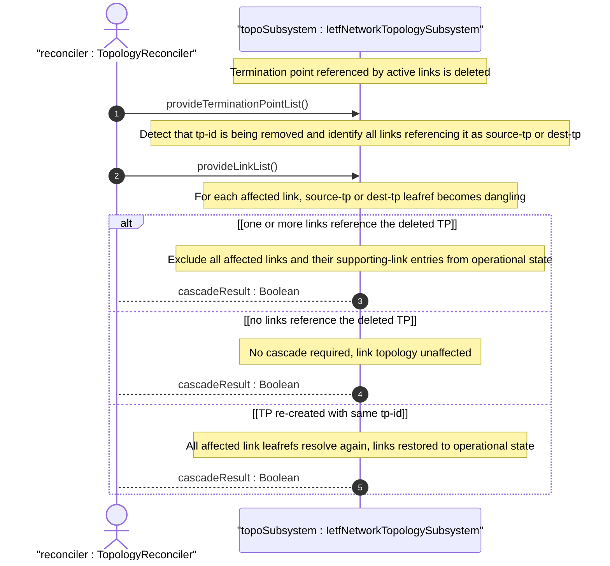
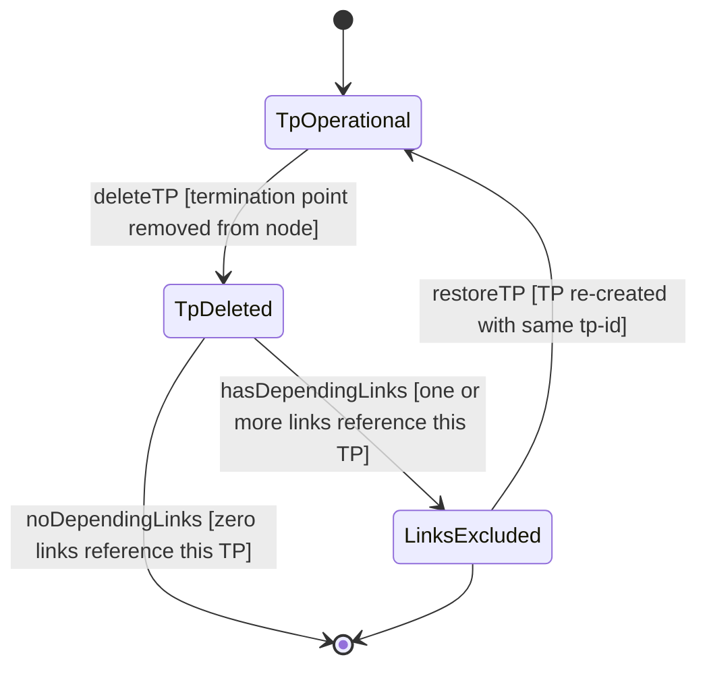

# User Story: Handle Link Reference Integrity on Termination Point Deletion Cascade

## Parent Epic
- [ ] #125 - [ietf-network-topology: Base Network Topology Augmentation](https://github.com/gintatkinson/3dgs-033/blob/main/docs/epics/epic-09-ietf-network-topology.md) (cascade from TP deletion to link operational exclusion, clause 4.2, 4.4.3)

## Domain Object Mapping
- **Primary Domain Objects:** TerminationPoint, Link, Source, Destination, tp-id, source-tp, dest-tp
- **Actor/Role:** TopologyReconciler — the system component that detects termination point deletion and reconciles all links whose endpoints referenced the deleted TP

## BDD Scenario (OOA/OOD Realization)

**As a** TopologyReconciler
**I want to** detect when a termination point referenced by active links is deleted and reconcile those links out of operational state
**So that** the topology graph accurately reflects the loss of a connectivity endpoint and does not report links anchored to non-existent termination points

**Given** a termination point "ge-0-0-1" on node "router-chicago-01"
**And** three links L1, L2, L3 reference "ge-0-0-1" as their source-tp
**When** the termination point "ge-0-0-1" is deleted from the node
**Then** links L1, L2, and L3 have their source-tp leafrefs become dangling
**And** all three links are excluded from the operational state datastore
**And** the links remain in the intended datastore with their configured source-tp references
**And** any supporting-link entries within L1, L2, and L3 are also excluded from operational state

**Given** the same scenario where "ge-0-0-1" is re-created with the same tp-id
**When** the TP is restored
**Then** links L1, L2, and L3 resolve their source-tp references again
**And** all three links are restored to the operational state datastore
**And** the topology graph reflects the restored connectivity

**Given** a termination point is deleted but no links reference it
**When** the deletion occurs
**Then** no link-level reconciliation is triggered
**And** the topology links are unaffected

## UML Sequence Diagram

## UML State Machine Diagram

## Operational Context

From the IETF Network Topologies YANG Data Model specification, Section 4.2 (Base Network Topology Data Model):

"A node has a list of termination points that are used to terminate links. An example of a termination point might be a physical or logical port or, more generally, an interface."

From the IETF Network Topologies YANG Data Model specification, Section 4.4.3 (Dealing with Changes in Underlay Networks):

"When a supporting node, link, or termination point is deleted, the supporting leafrefs in the overlay will be left dangling. To allow for this possibility, the data model makes use of the 'require-instance' construct of YANG 1.1."

## Required Features Matrix
- [ ] #132 - [Define Link List](https://github.com/gintatkinson/3dgs-033/blob/main/docs/features/feat-44-link-list.md) (link list entries are the targets of the cascade, links become nonoperational when their endpoint TPs are deleted)
- [ ] #133 - [Define Link Source Container](https://github.com/gintatkinson/3dgs-033/blob/main/docs/features/feat-45-link-source.md) (source-tp leafref is the reference that becomes dangling when the source TP is deleted)
- [ ] #134 - [Define Link Destination Container](https://github.com/gintatkinson/3dgs-033/blob/main/docs/features/feat-46-link-destination.md) (dest-tp leafref is the reference that becomes dangling when the destination TP is deleted)
- [ ] #136 - [Define Termination Point List](https://github.com/gintatkinson/3dgs-033/blob/main/docs/features/feat-48-termination-point-list.md) (termination points anchor links, their deletion triggers the cascade)

## Source References
Structural Schema: [ietf-network-topology@2018-02-26.yang](https://github.com/YangModels/yang/blob/main/standard/ietf/RFC/ietf-network-topology%402018-02-26.yang) (Clause: 6.2, lines 136-293)
Normative Specification: [the IETF Network Topologies YANG Data Model specification](https://datatracker.ietf.org/doc/rfc8345/) (Clause: 4.2, 4.4.3)
