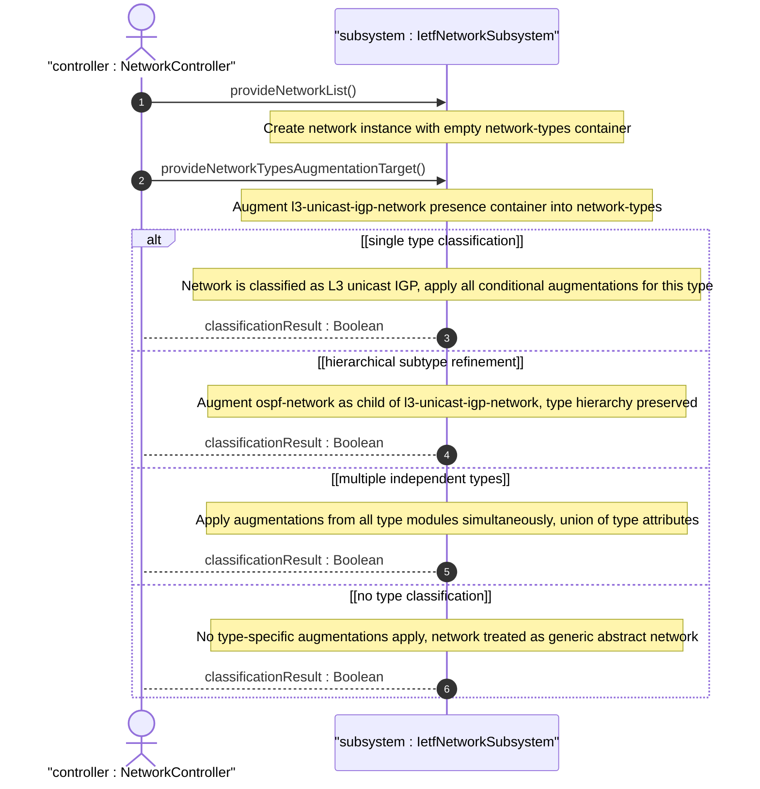

# User Story: Classify Network by Type for Conditional Augmentation Dispatch

## Parent Epic
- [ ] #124 - [ietf-network: Base Network Data Model](https://github.com/gintatkinson/3dgs-033/blob/main/docs/epics/epic-08-ietf-network.md) (network-types container as augmentation target for type-based conditional dispatch, clause 4.1 and 4.3)

## Domain Object Mapping
- **Primary Domain Objects:** Network, NetworkTypes, presence containers, augmentation target
- **Actor/Role:** NetworkController — the management application that classifies networks by type to enable technology-specific augmentations and operational behaviors

## BDD Scenario (OOA/OOD Realization)

**As a** NetworkController
**I want to** classify a network instance into one or more network types via presence containers augmented into the network-types container
**So that** technology-specific modules can conditionally apply their augmentations and behaviors based on the network's declared type identity

**Given** a network "core-l3" exists with an empty network-types container
**When** an L3 unicast IGP module augments the network-types container with a presence container "l3-unicast-igp-network"
**Then** the network is classified as a Layer 3 unicast IGP network
**And** all augmentations conditioned on the presence of "l3-unicast-igp-network" become active for this network

**Given** a network classified as "l3-unicast-igp-network"
**When** an OSPF module further augments "ospf-network" as a child presence container within "l3-unicast-igp-network"
**Then** the network carries a hierarchical type refinement — it is both an L3 unicast IGP network and an OSPF network
**And** the type hierarchy preserves the subtype relationship through nested presence containers

**Given** a network classified under multiple independent types (e.g., both L3 unicast IGP and Layer 2 switching)
**When** type-specific augmentations are dispatched
**Then** augmentations from both type modules apply simultaneously
**And** the network instance carries the union of all type-specific attributes

**Given** a network with no network type classification
**When** a technology-specific client queries for type-specific attributes
**Then** no type-specific data is returned
**And** the network is treated as a generic abstract network with only base model attributes

## UML Sequence Diagram

## Operational Context

From the IETF Network Topologies YANG Data Model specification, Section 4.1 (Base Network Model):

"A network has a certain type, such as L2, L3, OSPF, or IS-IS. A network can even have multiple types simultaneously. The type or types are captured underneath the container 'network-types'. In this model, it serves merely as an augmentation target; network-specific modules will later introduce new data nodes to represent new network types below this target, i.e., will insert them below 'network-types' via YANG augmentation."

"When a network is of a certain type, it will contain a corresponding data node. Network types SHOULD always be represented using presence containers, not leafs of type 'empty'. This allows the representation of hierarchies of network subtypes within the instance information."

From the IETF Network Topologies YANG Data Model specification, Section 4.3 (Extending the Data Model):

"First, a new network type needs to be defined; this is done by defining a presence container that represents the new network type. The new network type is inserted, by means of augmentation, below the network-types container."

## Required Features Matrix
- [ ] #127 - [Define Network List Entry](https://github.com/gintatkinson/3dgs-033/blob/main/docs/features/feat-39-network-list.md) (network list entry contains the network-types container, each network instance carries its type classification)
- [ ] #128 - [Define Network Types Container](https://github.com/gintatkinson/3dgs-033/blob/main/docs/features/feat-40-network-types.md) (network-types container serves as the augmentation target, presence containers inserted here define network type identity)

## Source References
Structural Schema: [ietf-network@2018-02-26.yang](https://github.com/YangModels/yang/blob/main/standard/ietf/RFC/ietf-network%402018-02-26.yang) (Clause: 6.1, lines 134-139)
Normative Specification: [the IETF Network Topologies YANG Data Model specification](https://datatracker.ietf.org/doc/rfc8345/) (Clause: 4.1, 4.3)
