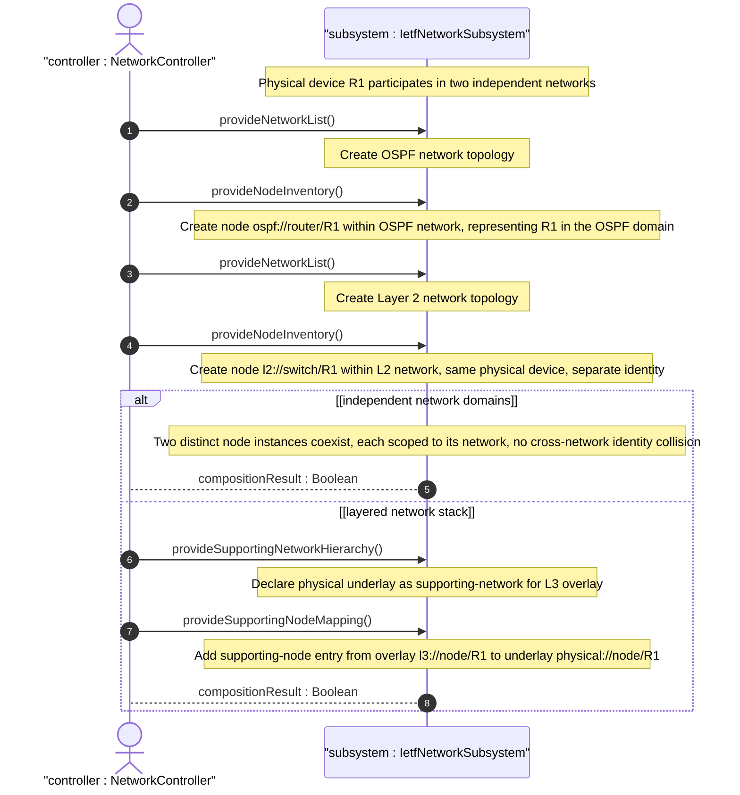

# User Story: Compose Multi-Domain Topology with Shared Devices Across Networks

## Parent Epic
- [ ] #124 - [ietf-network: Base Network Data Model](https://github.com/gintatkinson/3dgs-033/blob/main/docs/epics/epic-08-ietf-network.md) (multi-network node representation for shared devices, clause 4.4.9)

## Domain Object Mapping
- **Primary Domain Objects:** Network, Node, node-id, network-id
- **Actor/Role:** NetworkController — the multi-domain topology manager that represents the same physical device across multiple network instances and multiple layers

## BDD Scenario (OOA/OOD Realization)

**As a** NetworkController
**I want to** represent the same physical device across multiple topologies by instantiating separate node entries in each network
**So that** each topology domain independently manages its network-relative view of the device without cross-network identity collision

**Given** a physical router "R1" participates in both an OSPF topology network and a Layer 2 topology network
**When** the controller creates the OSPF network with a node representing R1 identified by node-id "ospf://router/R1"
**And** creates the Layer 2 network with a node representing the same R1 identified by node-id "l2://switch/R1"
**Then** two distinct node instances exist, each scoped to its containing network
**And** the node-ids may differ because each network provides an independent identity space for the device abstraction
**And** both nodes coexist independently without cross-network identity constraint violations

**Given** the same physical device participates in multiple layers of a network stack (e.g., physical layer and Layer 3 overlay)
**When** the controller creates a node "physical://node/R1" in the physical underlay network
**And** creates a node "l3://node/R1" in the Layer 3 overlay network with a supporting-node entry referencing "physical://node/R1"
**Then** the device is represented at both layers
**And** the layering relationship is captured via the supporting-node mechanism
**And** each node instance carries layer-specific attributes independently

**Given** a physical chassis with multiple line cards represented as separate nodes in a physical network
**When** the controller composes a router-level abstraction by creating a node in the routing topology with supporting-node entries referencing each line card node
**Then** the device-stack hierarchy is modeled from physical components up to the logical router abstraction
**And** the multi-domain composition spans physical, link-layer, and network-layer topologies

## UML Sequence Diagram

## Operational Context

From the IETF Network Topologies YANG Data Model specification, Section 4.4.9 (Representing the Same Device in Multiple Networks):

"One common requirement concerns the ability to indicate that the same device can be part of multiple networks and topologies. However, the data model defines a node as relative to the network that contains it. The same node cannot be part of multiple topologies. In many cases, a node will be the abstraction of a particular device in a network."

"It should be noted that a node does not exist independently of a network; instead, it is a part of the network that contains it. In cases where the same device or entity takes part in multiple networks, or at multiple layers of a networking stack, the same device or entity will be represented by multiple nodes, one for each network. In other words, the node represents an abstraction of the device for the particular network of which it is a part."

## Required Features Matrix
- [ ] #127 - [Define Network List Entry](https://github.com/gintatkinson/3dgs-033/blob/main/docs/features/feat-39-network-list.md) (each network domain provides an independent container for node instances representing shared devices)
- [ ] #130 - [Define Node List](https://github.com/gintatkinson/3dgs-033/blob/main/docs/features/feat-42-node-list.md) (node instances are scoped to their containing network, enabling independent representation of the same device across networks)

## Source References
Structural Schema: [ietf-network@2018-02-26.yang](https://github.com/YangModels/yang/blob/main/standard/ietf/RFC/ietf-network%402018-02-26.yang) (Clause: 6.1, lines 155-164)
Normative Specification: [the IETF Network Topologies YANG Data Model specification](https://datatracker.ietf.org/doc/rfc8345/) (Clause: 4.4.9)
